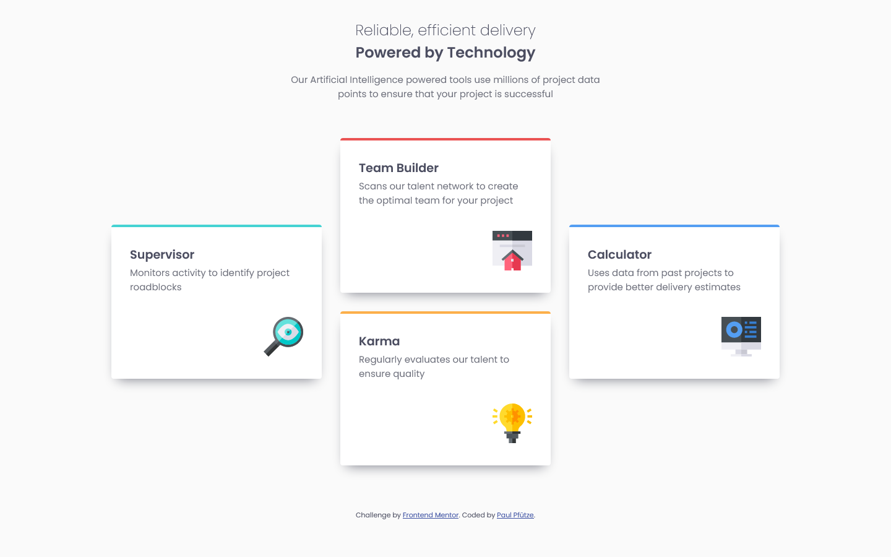

# Frontend Mentor - Four card feature section solution

This is a solution to the [Four card feature section challenge on Frontend Mentor](https://www.frontendmentor.io/challenges/four-card-feature-section-weK1eFYK).

## Table of contents

- [Overview](#overview)
  - [The challenge](#the-challenge)
  - [Screenshot](#screenshot)
  - [Links](#links)
- [My process](#my-process)
  - [Built with](#built-with)
  - [What I learned](#what-i-learned)
  - [Useful resources](#useful-resources)
- [Author](#author)

## Overview

### The challenge

Users should be able to:

- View the optimal layout for the site depending on their device's screen size

### Screenshot

### Links

- Solution URL: [https://www.frontendmentor.io/solutions/mobilefirst-four-card-feature-section-react-scss-kxRtmrs5TK](https://www.frontendmentor.io/solutions/mobilefirst-four-card-feature-section-react-scss-kxRtmrs5TK)
- Live Site URL: [https://sutontoch.github.io/four-card-feature-section/](https://sutontoch.github.io/four-card-feature-section/)

## My process

### Built with

- Semantic HTML5 markup
- CSS custom properties
- Flexbox
- Mobile-first workflow
- [React](https://reactjs.org/) - JS library
- [SCSS](https://sass-lang.com/documentation/syntax/) - CSS Preprocessor

### What I learned

- How to setup a basic React-Project using Vite
- Basic Syntax of React (JSX, Custom Components)
- How to pass content and styling to a Custom Component
- How to setup SCSS using --watch
- How to use Variables, @extend and @use in SCSS
- How to setup GitHub Pages for a React Project

### Useful resources

- [SCSS Basics](https://sass-lang.com/guide/) - Basic wiki for SCSS. Most things are explained well enough, except @use maybe.
- [React](https://scrimba.com/learn/learnreact) - Wonderful free course on Scrimba. Lesson 1.22. in particular helped me setup React locally.

## Author

- Frontend Mentor - [@SutonToch](https://www.frontendmentor.io/profile/SutonToch)